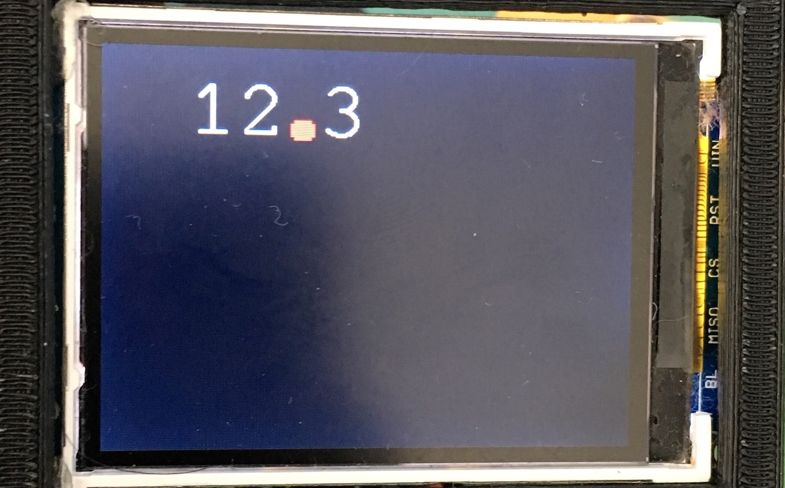

# EDot Calculator 
EDot Calculator is designed to assist people with special needs. 
Many autistic children can struggle with understanding decimal points when using calculators
because they are usually small gray dots in the bottom, yet have a major impact on the calculation.
EDot Calculator is a handheld calculator prototype that emphasizes the decimal point through size and color.

## History
We designed this calculator in association with a special needs teacher at Worcester Public Schools for kids with autism.
